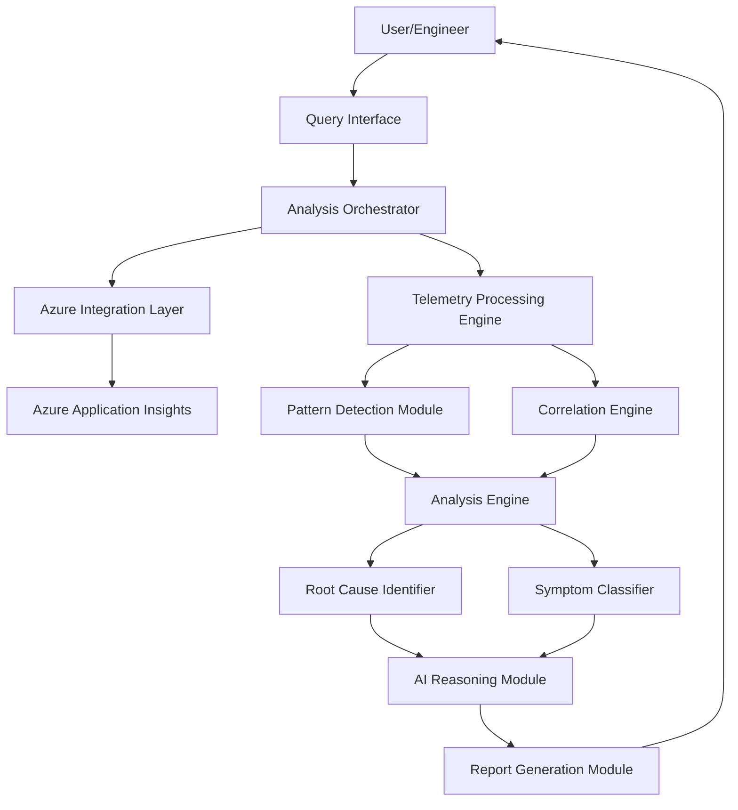

# Design Document: AI-Powered Root Cause Analysis Assistant

## Overview

The AI-Powered Root Cause Analysis (RCA) Assistant is an intelligent system that integrates with Azure Application Insights to automate incident analysis for cloud-based microservices architectures. The system ingests structured telemetry data, applies pattern detection algorithms and AI-powered analysis to identify root causes, and generates actionable recommendations for engineers.

### Key Design Principles

1. **Separation of Concerns**: Clear boundaries between data ingestion, analysis, and presentation layers
2. **Extensibility**: Pluggable architecture allowing new data sources and analysis strategies
3. **Resilience**: Graceful degradation when data is incomplete or services are unavailable
4. **Performance**: Efficient processing of large telemetry datasets with streaming and sampling
5. **Explainability**: Transparent reasoning that shows how conclusions were reached

### High-Level Architecture

The system consists of five major components:

1. **Azure Integration Layer**: Handles authentication and data retrieval from Azure Application Insights
2. **Telemetry Processing Engine**: Normalizes, filters, and prepares telemetry data for analysis
3. **Analysis Engine**: Performs pattern detection, correlation, and root cause identification
4. **AI Reasoning Module**: Uses LLM-based analysis to interpret patterns and generate insights
5. **Report Generation Module**: Formats findings into structured, actionable reports

## Architecture

### Component Diagram



### Data Flow

1. **Query Submission**: User submits natural language query specifying incident details
2. **Parameter Extraction**: Query parser extracts time range, affected services, and incident type
3. **Telemetry Retrieval**: Azure client fetches relevant telemetry data from Application Insights
4. **Data Processing**: Telemetry processor normalizes and structures the raw data
5. **Pattern Detection**: System identifies anomalies, spikes, and deviations from baseline
6. **Correlation Analysis**: Engine correlates events across services and dependencies
7. **Root Cause Identification**: Analyzer determines causal relationships and identifies root causes
8. **Symptom Classification**: System separates symptoms from root causes
9. **AI Reasoning**: LLM interprets findings and generates human-readable explanations
10. **Report Generation**: System produces structured report with recommendations
11. **Response Delivery**: Report is returned to user in natural language format

## Components and Interfaces

### 1. Azure Integration Layer

**Responsibility**: Authenticate with Azure and retrieve telemetry data from Application Insights.

**Key Classes**:

- `AzureAuthenticator`: Manages Azure credentials and token refresh
- `ApplicationInsightsClient`: Interfaces with Azure Application Insights API
- `TelemetryQuery`: Constructs and executes Kusto queries
- `RateLimitHandler`: Manages API rate limits with exponential backoff

**Interface**:

```typescript
interface IAzureIntegrationLayer {
  authenticate(credentials: AzureCredentials): Promise<AuthToken>;
  
  queryTelemetry(
    resourceId: string,
    query: TelemetryQuery,
    timeRange: TimeRange
  ): Promise<TelemetryDataset>;
  
  getExceptions(
    resourceId: string,
    timeRange: TimeRange,
    filters?: QueryFilters
  ): Promise<Exception[]>;
  
  getRequestMetrics(
    resourceId: string,
    timeRange: TimeRange,
    filters?: QueryFilters
  ): Promise<RequestMetric[]>;
  
  getDependencyMetrics(
    resourceId: string,
    timeRange: TimeRange,
    filters?: QueryFilters
  ): Promise<DependencyMetric[]>;
  
  getDeploymentEvents(
    resourceId: string,
    timeRange: TimeRange
  ): Promise<DeploymentEvent[]>;
}
```

**Error Handling**:
- Authentication failures return `AuthenticationError` with specific failure reason
- API rate limit exceeded triggers exponential backoff retry (max 3 attempts)
- Network failures return `NetworkError` with retry recommendation
- Invalid queries return `QueryValidationError` with correction suggestions

### 2. Telemetry Processing Engine

**Responsibility**: Normalize, filter, and prepare telemetry data for analysis.

**Key Classes**:

- `TelemetryNormalizer`: Converts raw telemetry into standardized format
- `DataFilter`: Applies time range and service filters
- `TimeSeriesBuilder`: Constructs time series from discrete events
- `BaselineCalculator`: Computes historical baselines for metrics

**Interface**:

```typescript
interface ITelemetryProcessor {
  normalize(rawData: RawTelemetry): NormalizedTelemetry;
  
  buildTimeSeries(
    events: TelemetryEvent[],
    granularity: TimeGranularity
  ): TimeSeries;
  
  calculateBaseline(
    metric: MetricType,
    historicalData: TimeSeries,
    method: BaselineMethod
  ): Baseline;
  
  filterByService(
    telemetry: NormalizedTelemetry,
    serviceNames: string[]
  ): NormalizedTelemetry;
  
  aggregateByTimeWindow(
    events: TelemetryEvent[],
    windowSize: Duration
  ): AggregatedMetrics[];
}
```

### 3. Pattern Detection Module

**Responsibility**: Identify abnormal patterns, spikes, and deviations in telemetry data.

**Key Classes**:

- `AnomalyDetector`: Detects statistical anomalies using z-score and IQR methods
- `SpikeDetector`: Identifies sudden increases in error rates or latency
- `TrendAnalyzer`: Detects gradual degradation patterns
- `ThresholdEvaluator`: Compares metrics against configured thresholds

**Interface**:

```typescript
interface IPatternDetector {
  detectAnomalies(
    timeSeries: TimeSeries,
    baseline: Baseline,
    sensitivity: number
  ): Anomaly[];
  
  detectSpikes(
    timeSeries: TimeSeries,
    threshold: number
  ): Spike[];
  
  detectLatencyIncrease(
    requestMetrics: RequestMetric[],
    baseline: Baseline
  ): LatencyAnomaly[];
  
  detectDependencyFailures(
    dependencyMetrics: DependencyMetric[]
  ): DependencyFailure[];
  
  rankAnomaliesBySeverity(
    anomalies: Anomaly[]
  ): RankedAnomaly[];
}
```

**Detection Algorithms**:

- **Z-Score Method**: Identifies values more than 3 standard deviations from mean
- **Interquartile Range (IQR)**: Detects outliers beyond 1.5 × IQR from quartiles
- **Rate of Change**: Flags sudden changes exceeding configurable percentage thresholds
- **Moving Average**: Compares current values against rolling average baseline

### 4. Correlation Engine

**Responsibility**: Correlate failures across services, dependencies, and infrastructure.

**Key Classes**:

- `TemporalCorrelator`: Identifies events occurring within time windows
- `CausalGraphBuilder`: Constructs directed graph of causal relationships
- `DependencyTracer`: Traces failures through service dependency chains
- `PropagationAnalyzer`: Determines failure propagation paths

**Interface**:

```typescript
interface ICorrelationEngine {
  correlateTemporal(
    events: TelemetryEvent[],
    timeWindow: Duration
  ): CorrelatedEventGroup[];
  
  buildCausalGraph(
    correlatedEvents: CorrelatedEventGroup[]
  ): CausalGraph;
  
  traceFailurePropagation(
    initialFailure: TelemetryEvent,
    allEvents: TelemetryEvent[]
  ): PropagationPath;
  
  identifyUpstreamCause(
    downstreamFailure: TelemetryEvent,
    dependencyGraph: ServiceDependencyGraph
  ): TelemetryEvent | null;
  
  accountForClockSkew(
    events: TelemetryEvent[],
    maxSkew: Duration
  ): TelemetryEvent[];
}
```

**Correlation Strategy**:

1. **Temporal Correlation**: Events within ±30 seconds are considered potentially related
2. **Service Dependency Correlation**: Failures in dependencies are linked to upstream failures
3. **Trace ID Correlation**: Events sharing distributed trace IDs are grouped
4. **Exception Type Correlation**: Similar exception patterns across services are linked

### 5. Root Cause Identifier

**Responsibility**: Determine the most likely root cause(s) from correlated failures.

**Key Classes**:

- `CausalAnalyzer`: Analyzes causal graphs to find root nodes
- `EvidenceScorer`: Scores potential root causes by evidence strength
- `DeploymentCorrelator`: Links incidents to recent deployments
- `ResourceAnalyzer`: Identifies resource exhaustion as root causes

**Interface**:

```typescript
interface IRootCauseIdentifier {
  identifyRootCauses(
    causalGraph: CausalGraph,
    anomalies: Anomaly[],
    deployments: DeploymentEvent[]
  ): RankedRootCause[];
  
  findEarliestFailure(
    causalGraph: CausalGraph
  ): TelemetryEvent;
  
  scoreRootCauseEvidence(
    potentialCause: TelemetryEvent,
    supportingEvidence: TelemetryEvent[]
  ): EvidenceScore;
  
  correlateWithDeployments(
    incident: Incident,
    deployments: DeploymentEvent[]
  ): DeploymentCorrelation[];
  
  identifyResourceConstraints(
    metrics: ResourceMetric[]
  ): ResourceConstraint[];
}
```

**Root Cause Ranking Criteria**:

1. **Temporal Priority**: Earlier failures ranked higher (likely causes, not effects)
2. **Evidence Strength**: More correlated events increase confidence score
3. **Deployment Proximity**: Incidents within 1 hour of deployment flagged
4. **Exception Uniqueness**: Unique exceptions ranked higher than common errors
5. **Dependency Position**: Failures in critical dependencies weighted higher

### 6. Symptom Classifier

**Responsibility**: Distinguish symptoms from root causes in the causal chain.

**Key Classes**:

- `SymptomDetector`: Identifies downstream effects of root causes
- `CascadeAnalyzer`: Analyzes failure cascade patterns
- `SymptomLinker`: Links symptoms to their root causes

**Interface**:

```typescript
interface ISymptomClassifier {
  classifyFindings(
    findings: Finding[],
    causalGraph: CausalGraph
  ): ClassifiedFindings;
  
  identifySymptoms(
    causalGraph: CausalGraph,
    rootCauses: RootCause[]
  ): Symptom[];
  
  linkSymptomsToRootCauses(
    symptoms: Symptom[],
    rootCauses: RootCause[]
  ): SymptomCauseMapping[];
  
  classifyTimeouts(
    timeoutErrors: Exception[],
    upstreamFailures: TelemetryEvent[]
  ): Classification;
}
```

**Classification Rules**:

- **Root Cause**: Event with no upstream causal dependencies in the incident window
- **Symptom**: Event with identified upstream cause in the causal graph
- **Timeout as Symptom**: Timeout errors with upstream service degradation
- **Cascade Effect**: Failures in multiple services following initial failure

### 7. AI Reasoning Module

**Responsibility**: Use LLM to interpret patterns, generate explanations, and create recommendations.

**Key Classes**:

- `LLMClient`: Interfaces with language model API
- `PromptBuilder`: Constructs prompts with telemetry context
- `ReasoningEngine`: Orchestrates AI analysis workflow
- `RecommendationGenerator`: Generates actionable next steps

**Interface**:

```typescript
interface IAIReasoningModule {
  analyzeIncident(
    incident: Incident,
    rootCauses: RootCause[],
    symptoms: Symptom[],
    telemetryContext: TelemetryContext
  ): AIAnalysis;
  
  generateExplanation(
    rootCause: RootCause,
    supportingEvidence: Evidence[]
  ): string;
  
  generateRecommendations(
    rootCauses: RootCause[],
    incidentContext: IncidentContext
  ): Recommendation[];
  
  prioritizeRecommendations(
    recommendations: Recommendation[]
  ): PrioritizedRecommendation[];
}
```

**AI Prompt Structure**:

```
You are an expert SRE analyzing a production incident.

INCIDENT SUMMARY:
- Time Range: {timeRange}
- Affected Services: {services}
- Severity: {severity}

TELEMETRY FINDINGS:
{anomalies, correlations, patterns}

ROOT CAUSE CANDIDATES:
{rankedRootCauses}

TASK:
1. Explain the most likely root cause in 2-3 sentences
2. Distinguish symptoms from root causes
3. Provide 3 actionable recommendations prioritized by impact

Be concise and specific. Focus on what engineers should do next.
```

### 8. Report Generation Module

**Responsibility**: Format analysis results into structured, human-readable reports.

**Key Classes**:

- `ReportFormatter`: Formats report sections
- `TimelineBuilder`: Constructs chronological event timeline
- `VisualizationGenerator`: Creates charts and graphs (optional)
- `MarkdownRenderer`: Renders report in Markdown format

**Interface**:

```typescript
interface IReportGenerator {
  generateReport(
    analysis: AIAnalysis,
    rootCauses: RootCause[],
    symptoms: Symptom[],
    recommendations: Recommendation[]
  ): IncidentReport;
  
  buildTimeline(
    events: TelemetryEvent[]
  ): Timeline;
  
  formatRootCauseSection(
    rootCauses: RootCause[]
  ): string;
  
  formatRecommendations(
    recommendations: PrioritizedRecommendation[]
  ): string;
  
  renderAsMarkdown(
    report: IncidentReport
  ): string;
}
```

**Report Structure**:

```markdown
# Incident Analysis Report

## Executive Summary
[2-3 sentence overview of incident and root cause]

## Timeline
[Chronological list of key events with timestamps]

## Root Cause Analysis
### Primary Root Cause
[Detailed explanation with evidence]

### Contributing Factors
[Additional causes if applicable]

## Symptoms Observed
[List of symptoms linked to root causes]

## Recommendations
1. [Immediate action - highest priority]
2. [Short-term mitigation]
3. [Long-term prevention]

## Supporting Evidence
[Relevant telemetry data, metrics, and logs]
```

### 9. Query Interface

**Responsibility**: Parse natural language queries and orchestrate analysis workflow.

**Key Classes**:

- `QueryParser`: Extracts parameters from natural language
- `AnalysisOrchestrator`: Coordinates analysis workflow
- `ResponseFormatter`: Formats responses in natural language

**Interface**:

```typescript
interface IQueryInterface {
  parseQuery(
    naturalLanguageQuery: string
  ): ParsedQuery;
  
  executeAnalysis(
    query: ParsedQuery
  ): Promise<IncidentReport>;
  
  requestClarification(
    ambiguousQuery: string,
    missingParams: string[]
  ): ClarificationRequest;
  
  formatResponse(
    report: IncidentReport,
    query: ParsedQuery
  ): string;
}
```

**Query Parsing Examples**:

- "What caused the API failures between 2pm and 3pm today?"
  - Time Range: [14:00, 15:00] today
  - Focus: API failures
  - Services: All API services

- "Why is the checkout service slow?"
  - Time Range: Last 1 hour (default)
  - Focus: Latency issues
  - Services: checkout-service

- "Analyze the incident affecting user-service and payment-service"
  - Time Range: Last 1 hour (default)
  - Services: user-service, payment-service

## Data Models

### Core Data Structures

```typescript
// Telemetry Data Types

interface TelemetryEvent {
  timestamp: Date;
  eventType: 'exception' | 'request' | 'dependency' | 'deployment' | 'metric';
  serviceName: string;
  traceId?: string;
  spanId?: string;
  properties: Record<string, any>;
}

interface Exception extends TelemetryEvent {
  exceptionType: string;
  message: string;
  stackTrace: string;
  severity: 'error' | 'warning' | 'critical';
}

interface RequestMetric extends TelemetryEvent {
  operationName: string;
  duration: number;
  responseCode: number;
  success: boolean;
}

interface DependencyMetric extends TelemetryEvent {
  dependencyName: string;
  dependencyType: string;
  duration: number;
  success: boolean;
  resultCode?: string;
}

interface DeploymentEvent extends TelemetryEvent {
  deploymentId: string;
  version: string;
  deployedBy: string;
}

// Analysis Types

interface Anomaly {
  id: string;
  timestamp: Date;
  metricName: string;
  observedValue: number;
  expectedValue: number;
  deviationScore: number;
  severity: 'low' | 'medium' | 'high' | 'critical';
}

interface CorrelatedEventGroup {
  id: string;
  events: TelemetryEvent[];
  timeWindow: TimeRange;
  correlationScore: number;
}

interface CausalGraph {
  nodes: TelemetryEvent[];
  edges: CausalEdge[];
}

interface CausalEdge {
  from: string; // event ID
  to: string;   // event ID
  confidence: number;
  evidenceType: 'temporal' | 'dependency' | 'trace' | 'pattern';
}

interface RootCause {
  id: string;
  event: TelemetryEvent;
  confidence: number;
  evidenceScore: number;
  explanation: string;
  category: 'deployment' | 'resource' | 'dependency' | 'code' | 'infrastructure';
}

interface Symptom {
  id: string;
  event: TelemetryEvent;
  linkedRootCause: string; // root cause ID
  description: string;
}

interface Recommendation {
  priority: number;
  action: string;
  rationale: string;
  estimatedImpact: 'high' | 'medium' | 'low';
  estimatedEffort: 'minutes' | 'hours' | 'days';
}

interface IncidentReport {
  incidentId: string;
  summary: string;
  timeRange: TimeRange;
  affectedServices: string[];
  timeline: TimelineEvent[];
  rootCauses: RootCause[];
  symptoms: Symptom[];
  recommendations: Recommendation[];
  supportingEvidence: Evidence[];
  generatedAt: Date;
}

// Supporting Types

interface TimeRange {
  start: Date;
  end: Date;
}

interface Baseline {
  metricName: string;
  mean: number;
  standardDeviation: number;
  percentiles: Record<number, number>;
}

interface Evidence {
  type: 'metric' | 'log' | 'trace' | 'deployment';
  description: string;
  data: any;
}
```


## Correctness Properties

*A property is a characteristic or behavior that should hold true across all valid executions of a system—essentially, a formal statement about what the system should do. Properties serve as the bridge between human-readable specifications and machine-verifiable correctness guarantees.*

### Property 1: Azure Connection with Valid Credentials

*For any* valid Azure credentials and Application Insights resource identifier, establishing a connection should succeed and allow retrieval of all telemetry types (exceptions, requests, dependencies, deployments).

**Validates: Requirements 1.1, 1.2**

### Property 2: Authentication Error Handling

*For any* invalid Azure credentials, the connection attempt should fail with a descriptive error message that indicates the specific authentication issue.

**Validates: Requirements 1.3**

### Property 3: Time Range Filtering

*For any* time range filter applied to telemetry queries, all returned telemetry events should have timestamps within the specified time range (inclusive).

**Validates: Requirements 1.4**

### Property 4: Anomaly Detection Across Metric Types

*For any* time series containing a known anomaly (spike in error rate, latency increase, dependency failure, or statistical deviation), the pattern detector should identify and flag the anomaly with appropriate severity.

**Validates: Requirements 2.1, 2.2, 2.3, 2.4**

### Property 5: Anomaly Severity Ranking

*For any* set of detected anomalies with different severity levels, the ranking function should order them such that higher severity anomalies appear before lower severity ones.

**Validates: Requirements 2.5**

### Property 6: Temporal Correlation Detection

*For any* set of telemetry events from multiple services where failures occur within the correlation time window (±30 seconds), the correlation engine should group these events as potentially related.

**Validates: Requirements 3.1, 3.5**

### Property 7: Failure Propagation Tracing

*For any* causal graph with a downstream dependency failure, tracing the propagation path should identify the upstream service that experienced the initial failure.

**Validates: Requirements 3.2, 3.4**

### Property 8: Chronological Failure Ordering

*For any* set of correlated failures across multiple services, the system should order them chronologically by timestamp, producing a valid failure propagation sequence.

**Validates: Requirements 3.3**

### Property 9: Root Cause Identification from Causal Graph

*For any* causal graph representing an incident, the earliest failure point (node with no incoming edges) should be identified as a root cause candidate.

**Validates: Requirements 4.1**

### Property 10: Root Cause Ranking by Evidence

*For any* set of potential root causes with different evidence scores, the ranking function should order them such that causes with stronger evidence appear first.

**Validates: Requirements 4.2**

### Property 11: Deployment Correlation

*For any* incident occurring within 1 hour of a deployment event, the deployment should be flagged as a potential root cause.

**Validates: Requirements 4.3**

### Property 12: Resource Constraint Identification

*For any* set of infrastructure metrics showing resource exhaustion (CPU > 90%, memory > 95%, disk > 95%), the system should identify the resource constraint as a potential root cause.

**Validates: Requirements 4.4**

### Property 13: Exception Grouping

*For any* set of exceptions with the same exception type and similar stack traces, the system should group them together as a common failure mode.

**Validates: Requirements 4.5**

### Property 14: Symptom vs Root Cause Classification

*For any* finding in the causal graph, it should be labeled as either "symptom" (has upstream cause) or "root cause" (no upstream cause), but not both.

**Validates: Requirements 5.1**

### Property 15: Cascade Symptom Identification

*For any* failure cascade where service A fails before service B, and B depends on A, the failure in service B should be classified as a symptom with service A's failure as the root cause.

**Validates: Requirements 5.2, 5.3, 5.4**

### Property 16: Symptom-to-Cause Linking

*For any* symptom identified in the analysis, it should have a link to at least one identified root cause.

**Validates: Requirements 5.5**

### Property 17: Recommendation Generation

*For any* identified root cause, the system should generate at least one actionable recommendation that is concise (< 200 characters) and specific.

**Validates: Requirements 6.1, 6.6**

### Property 18: Recommendation Prioritization

*For any* set of recommendations with different impact and effort scores, they should be ordered such that high-impact, low-effort recommendations appear first.

**Validates: Requirements 6.2**

### Property 19: Deployment Rollback Recommendation

*For any* root cause that is a deployment event, the recommendations should include a rollback action.

**Validates: Requirements 6.3**

### Property 20: Resource Scaling Recommendation

*For any* root cause that is a resource constraint, the recommendations should include a specific scaling action for the constrained resource.

**Validates: Requirements 6.4**

### Property 21: Diagnostic Recommendations for Low Confidence

*For any* root cause with confidence score below 0.5, the recommendations should include at least one diagnostic step to gather more information.

**Validates: Requirements 6.5**

### Property 22: Report Completeness

*For any* completed analysis, the generated report should contain all required sections: incident summary, timeline, root causes, symptoms, recommendations, and supporting evidence.

**Validates: Requirements 7.1, 7.2**

### Property 23: Timeline Chronological Ordering

*For any* timeline in a report, all events should be ordered chronologically by timestamp in ascending order.

**Validates: Requirements 7.3**

### Property 24: Primary vs Contributing Cause Distinction

*For any* report with multiple root causes, exactly one should be marked as "primary" and others as "contributing".

**Validates: Requirements 7.4**

### Property 25: Report Structure Validation

*For any* generated report, it should be parseable as valid Markdown with all expected section headers present.

**Validates: Requirements 7.5**

### Property 26: Query Parameter Extraction

*For any* natural language query containing time expressions, service names, or incident types, the parser should extract these as structured parameters.

**Validates: Requirements 8.1**

### Property 27: Time Range Query Scoping

*For any* query with an extracted time range, the analysis should only consider telemetry events within that time range.

**Validates: Requirements 8.2**

### Property 28: Service-Focused Analysis

*For any* query mentioning specific service names, the analysis should prioritize telemetry from those services in the results.

**Validates: Requirements 8.3**

### Property 29: Clarification Request for Ambiguous Queries

*For any* query missing required parameters (time range or affected services), the system should return a clarification request instead of proceeding with analysis.

**Validates: Requirements 8.4**

### Property 30: Graceful Degradation with Incomplete Data

*For any* analysis where telemetry data is incomplete (< 50% of expected data types), the system should proceed with available data and include a limitations note in the report.

**Validates: Requirements 9.1**

### Property 31: AI Failure Fallback

*For any* analysis where the AI reasoning module fails, the system should return a report containing raw telemetry data and a descriptive error message.

**Validates: Requirements 9.3**

### Property 32: Error Logging

*For any* error occurring during analysis, the system should log an error entry containing timestamp, error type, error message, and stack trace.

**Validates: Requirements 9.5**

### Property 33: Pagination for Large Datasets

*For any* telemetry query returning more than 1000 events, the system should use pagination to retrieve data in chunks.

**Validates: Requirements 10.2**

### Property 34: Data Prioritization

*For any* analysis with more than 10,000 telemetry events, the system should prioritize events with higher severity or closer temporal proximity to the incident window.

**Validates: Requirements 10.4**

### Property 35: Intelligent Sampling

*For any* telemetry dataset exceeding 50,000 events, the system should apply stratified sampling that maintains representation of all event types and severity levels.

**Validates: Requirements 10.5**

## Error Handling

### Error Categories

1. **Authentication Errors**
   - Invalid credentials: Return `AuthenticationError` with specific failure reason
   - Expired tokens: Automatically refresh token and retry
   - Insufficient permissions: Return `PermissionError` with required permissions

2. **Data Retrieval Errors**
   - API rate limits: Implement exponential backoff (1s, 2s, 4s) with max 3 retries
   - Network failures: Retry with timeout increase, return `NetworkError` after 3 failures
   - Invalid queries: Return `QueryValidationError` with correction suggestions
   - Empty results: Proceed with empty dataset, note in report

3. **Analysis Errors**
   - Insufficient data: Proceed with available data, include limitations in report
   - AI model failures: Fall back to rule-based analysis and raw data presentation
   - Timeout during processing: Return partial results with timeout notification
   - Invalid telemetry format: Skip malformed events, log warning, continue analysis

4. **System Errors**
   - Out of memory: Implement sampling to reduce dataset size
   - Concurrent request overload: Queue requests with estimated wait time
   - Dependency service unavailable: Return cached results if available, otherwise error

### Error Response Format

```typescript
interface ErrorResponse {
  errorCode: string;
  errorMessage: string;
  errorDetails: Record<string, any>;
  timestamp: Date;
  requestId: string;
  suggestedAction?: string;
}
```

### Retry Strategy

- **Transient Errors**: Retry with exponential backoff (max 3 attempts)
- **Rate Limit Errors**: Wait for rate limit reset, then retry
- **Authentication Errors**: Refresh token once, then fail
- **Validation Errors**: Do not retry, return error immediately

### Logging Strategy

- **Error Logs**: All errors with full context and stack traces
- **Warning Logs**: Degraded functionality, missing data, low confidence results
- **Info Logs**: Analysis start/complete, major processing steps
- **Debug Logs**: Detailed telemetry processing, correlation calculations

## Testing Strategy

### Dual Testing Approach

The testing strategy employs both unit tests and property-based tests to ensure comprehensive coverage:

- **Unit Tests**: Verify specific examples, edge cases, and error conditions
- **Property Tests**: Verify universal properties across all inputs through randomization

Both approaches are complementary and necessary. Unit tests catch concrete bugs in specific scenarios, while property tests verify general correctness across a wide input space.

### Property-Based Testing

**Framework**: Use `fast-check` for TypeScript/JavaScript implementation

**Configuration**:
- Minimum 100 iterations per property test (due to randomization)
- Each property test must reference its design document property
- Tag format: `// Feature: ai-rca-assistant, Property {number}: {property_text}`

**Property Test Examples**:

```typescript
// Feature: ai-rca-assistant, Property 3: Time Range Filtering
test('all returned telemetry events fall within specified time range', () => {
  fc.assert(
    fc.property(
      fc.date(), // start time
      fc.date(), // end time
      fc.array(generateTelemetryEvent()), // telemetry events
      (start, end, events) => {
        const timeRange = { start, end: end > start ? end : start };
        const filtered = filterByTimeRange(events, timeRange);
        return filtered.every(e => 
          e.timestamp >= timeRange.start && e.timestamp <= timeRange.end
        );
      }
    ),
    { numRuns: 100 }
  );
});

// Feature: ai-rca-assistant, Property 5: Anomaly Severity Ranking
test('anomalies are ranked by severity in descending order', () => {
  fc.assert(
    fc.property(
      fc.array(generateAnomaly(), { minLength: 2 }),
      (anomalies) => {
        const ranked = rankAnomaliesBySeverity(anomalies);
        return isDescendingBySeverity(ranked);
      }
    ),
    { numRuns: 100 }
  );
});

// Feature: ai-rca-assistant, Property 14: Symptom vs Root Cause Classification
test('each finding is classified as either symptom or root cause, not both', () => {
  fc.assert(
    fc.property(
      generateCausalGraph(),
      (graph) => {
        const classified = classifyFindings(graph);
        return classified.every(f => 
          (f.type === 'symptom') !== (f.type === 'rootCause')
        );
      }
    ),
    { numRuns: 100 }
  );
});
```

**Generator Functions**:

Property tests require custom generators for domain-specific types:

```typescript
// Generate random telemetry events
function generateTelemetryEvent(): fc.Arbitrary<TelemetryEvent> {
  return fc.record({
    timestamp: fc.date(),
    eventType: fc.constantFrom('exception', 'request', 'dependency', 'deployment'),
    serviceName: fc.stringOf(fc.char(), { minLength: 5, maxLength: 20 }),
    traceId: fc.uuid(),
    properties: fc.dictionary(fc.string(), fc.anything())
  });
}

// Generate anomalies with different severities
function generateAnomaly(): fc.Arbitrary<Anomaly> {
  return fc.record({
    id: fc.uuid(),
    timestamp: fc.date(),
    metricName: fc.string(),
    observedValue: fc.double(),
    expectedValue: fc.double(),
    deviationScore: fc.double({ min: 0, max: 10 }),
    severity: fc.constantFrom('low', 'medium', 'high', 'critical')
  });
}

// Generate causal graphs
function generateCausalGraph(): fc.Arbitrary<CausalGraph> {
  return fc.record({
    nodes: fc.array(generateTelemetryEvent(), { minLength: 2, maxLength: 10 }),
    edges: fc.array(fc.record({
      from: fc.string(),
      to: fc.string(),
      confidence: fc.double({ min: 0, max: 1 }),
      evidenceType: fc.constantFrom('temporal', 'dependency', 'trace', 'pattern')
    }))
  });
}
```

### Unit Testing

**Focus Areas**:
- Specific examples demonstrating correct behavior
- Edge cases (empty datasets, single events, extreme values)
- Error conditions (invalid inputs, missing data, API failures)
- Integration points between components

**Unit Test Examples**:

```typescript
describe('AzureIntegrationLayer', () => {
  test('should throw AuthenticationError for invalid credentials', async () => {
    const invalidCreds = { clientId: 'invalid', clientSecret: 'invalid' };
    await expect(azureClient.authenticate(invalidCreds))
      .rejects.toThrow(AuthenticationError);
  });

  test('should handle empty telemetry results gracefully', async () => {
    const result = await azureClient.queryTelemetry(resourceId, query, timeRange);
    expect(result).toEqual([]);
  });
});

describe('PatternDetector', () => {
  test('should detect spike when value exceeds 3 standard deviations', () => {
    const baseline = { mean: 100, standardDeviation: 10 };
    const timeSeries = [100, 105, 98, 140, 102]; // 140 is 4 std devs
    const anomalies = detector.detectAnomalies(timeSeries, baseline, 3);
    expect(anomalies).toHaveLength(1);
    expect(anomalies[0].observedValue).toBe(140);
  });

  test('should return empty array when no anomalies present', () => {
    const baseline = { mean: 100, standardDeviation: 10 };
    const timeSeries = [100, 105, 98, 102, 97];
    const anomalies = detector.detectAnomalies(timeSeries, baseline, 3);
    expect(anomalies).toEqual([]);
  });
});

describe('RootCauseIdentifier', () => {
  test('should identify deployment as root cause when incident occurs within 1 hour', () => {
    const incident = { timestamp: new Date('2024-01-01T15:30:00Z') };
    const deployment = { timestamp: new Date('2024-01-01T15:00:00Z') };
    const correlation = correlateWithDeployments(incident, [deployment]);
    expect(correlation).toHaveLength(1);
    expect(correlation[0].isLikelyRootCause).toBe(true);
  });
});
```

### Integration Testing

**Scope**: Test end-to-end workflows with real Azure Application Insights (test environment)

**Test Scenarios**:
1. Complete RCA workflow from query to report generation
2. Multi-service failure correlation
3. Deployment-related incident analysis
4. Resource exhaustion scenario
5. Graceful degradation with partial data

### Performance Testing

**Benchmarks**:
- Analysis completion time: < 60 seconds for standard incidents
- Memory usage: < 2GB for datasets up to 50,000 events
- Concurrent requests: Support 10 simultaneous analyses without degradation

**Load Testing**:
- Simulate high telemetry volume (100,000+ events)
- Test sampling and prioritization strategies
- Verify timeout mechanisms

### Test Coverage Goals

- **Line Coverage**: > 80%
- **Branch Coverage**: > 75%
- **Property Test Coverage**: All 35 correctness properties implemented
- **Integration Test Coverage**: All major workflows covered

### Continuous Testing

- Run unit tests on every commit
- Run property tests on every pull request
- Run integration tests nightly
- Run performance tests weekly
